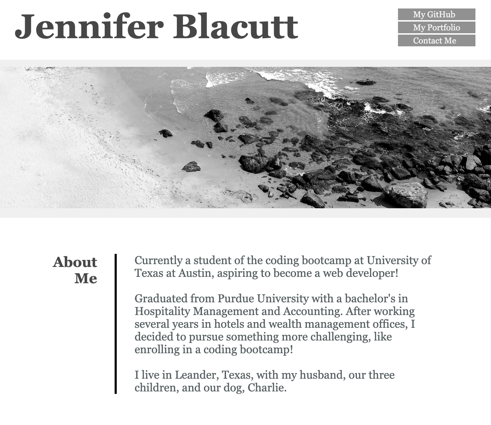

# Portfolio

## Description

I built this webpage to display my skills and talents by showcasing a portfolio of my projects that highlights my best work and processes.

This will help prospective employers to review my work skills and assess whether I am a good candidate for an open position.

By building this webpage, I was able to further apply advanced CSS skills learned from bootcamp to create this webpage which will be used in my job search.

## Installation

N/A

## Usage

Webpage preview:

View deployed page here:

[My Portfolio]()

## License

Please refer to the MIT License in the repo.